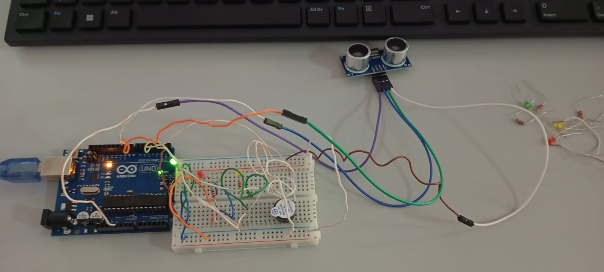

# 🚗 Sensor de Estacionamento Ultrassônico com Arduino

Um sistema inteligente de assistência para manobras e sensor de ré desenvolvido com Arduino. O projeto utiliza um sensor ultrassônico para medir a distância de obstáculos em tempo real, alertando o motorista de forma visual (LEDs) e sonora (Buzzer) conforme a proximidade do objeto.

---

## 📌 Funcionalidades

O sistema opera em 4 zonas de segurança baseadas na distância do obstáculo:

| Distância | Status | Indicação Visual | Indicação Sonora |
| :--- | :--- | :--- | :--- |
| **Mais de 80 cm** | Livre | Nenhum LED aceso | Silêncio |
| **Entre 51 cm e 80 cm** | Atenção | **LED Verde** aceso | Bipes lentos |
| **Entre 21 cm e 50 cm** | Cuidado | **LED Amarelo** aceso | Bipes rápidos |
| **Menos de 20 cm** | Perigo Absoluto | **LED Vermelho** aceso | Som contínuo (Travado) |

---


**Link do Vídeo:** https://drive.google.com/drive/folders/1ihRfC0cPYGw1mbDcGVSqGq4j13_uY0lj?usp=sharing

**Link do Projeto Online:** https://www.tinkercad.com/things/jXov5wKZsZ2-sensor-de-proximidade?sharecode=Jy5BsOOHGrGVhCOj4p9leXUyu9XjImgnWtTkStT-PAE


---



## 🛠️ Componentes Utilizados

* 1x Arduino UNO (ou compatível)
* 1x Sensor Ultrassônico HC-SR04
* 1x Buzzer Piezoelétrico
* 1x LED Verde
* 1x LED Amarelo
* 1x LED Vermelho
* 3x Resistores (220Ω a 330Ω) para os LEDs
* 1x Protoboard e Jumpers para conexão

---

## 🔌 Conexões do Circuito (Pinagem)

### Sensor Ultrassônico HC-SR04
* **VCC** ➡️ 5V do Arduino
* **Trig** ➡️ Pino Digital 9
* **Echo** ➡️ Pino Digital 10
* **GND** ➡️ GND do Arduino

### LEDs e Buzzer
* **LED Verde (Anodo)** ➡️ Pino Digital 2 (com resistor em série)
* **LED Amarelo (Anodo)** ➡️ Pino Digital 3 (com resistor em série)
* **LED Vermelho (Anodo)** ➡️ Pino Digital 4 (com resistor em série)
* **Buzzer (+)** ➡️ Pino Digital 5
* *Todos os catodos (GND) conectados ao barramento negativo.*

---

## 💻 Código Fonte

O código está configurado com filtros de segurança e envia relatórios constantes (logs) para o **Monitor Serial** para ajudar nos testes de calibração.

```cpp
// Definição dos pinos do Sensor Ultrassônico
const int pinoTrig = 9;
const int pinoEcho = 10;

// Definição dos pinos dos LEDs
const int ledVerde   = 2;
const int ledAmarelo = 3;
const int ledVermelho = 4;

// Definição do pino do Buzzer (Som)
const int pinoBuzzer = 5;

long duracao;
int distancia;

void setup() {
  pinMode(pinoTrig, OUTPUT);
  pinMode(pinoEcho, INPUT);
  pinMode(ledVerde, OUTPUT);
  pinMode(ledAmarelo, OUTPUT);
  pinMode(ledVermelho, OUTPUT);
  pinMode(pinoBuzzer, OUTPUT);
  
  Serial.begin(9600);
  Serial.println("=========================================");
  Serial.println("   SISTEMA INICIALIZADO: SENSOR DE RÉ     ");
  Serial.println("=========================================");
}

void loop() {
  digitalWrite(pinoTrig, LOW);
  delayMicroseconds(2);
  digitalWrite(pinoTrig, HIGH);
  delayMicroseconds(10);
  digitalWrite(pinoTrig, LOW);
  
  duracao = pulseIn(pinoEcho, HIGH);
  distancia = duracao * 0.034 / 2;
  
  Serial.print("[LOG] Distancia atual: ");
  Serial.print(distancia);
  Serial.print(" cm | Status: ");

  if (distancia > 80 || distancia <= 0) {
    Serial.println("LIVRE - Tudo apagado");
    desligarTudo();
  } 
  else if (distancia <= 80 && distancia > 50) {
    Serial.println("ATENÇÃO - LED Verde Ligado");
    desligarTudo();
    digitalWrite(ledVerde, HIGH);
    bipar(100, 500);
  } 
  else if (distancia <= 50 && distancia > 20) {
    Serial.println("CUIDADO - LED Amarelo Ligado");
    desligarTudo();
    digitalWrite(ledAmarelo, HIGH);
    bipar(100, 200);
  } 
  else if (distancia <= 20) {
    Serial.println("PERIGO ABSOLUTO! - LED Vermelho e Buzzer Continuo");
    desligarTudo();
    digitalWrite(ledVermelho, HIGH);
    digitalWrite(pinoBuzzer, HIGH);
    delay(100);
  }
}

void desligarTudo() {
  digitalWrite(ledVerde, LOW);
  digitalWrite(ledAmarelo, LOW);
  digitalWrite(ledVermelho, LOW);
  digitalWrite(pinoBuzzer, LOW);
}

void bipar(int tempoAcesdo, int tempoDesligado) {
  digitalWrite(pinoBuzzer, HIGH);
  delay(tempoAcesdo);
  digitalWrite(pinoBuzzer, LOW);
  delay(tempoDesligado);
}
